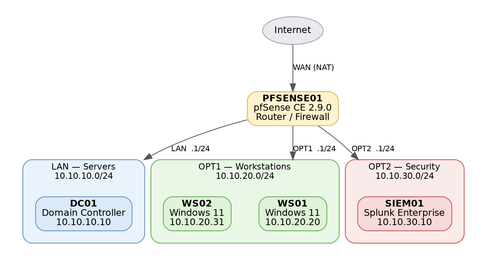
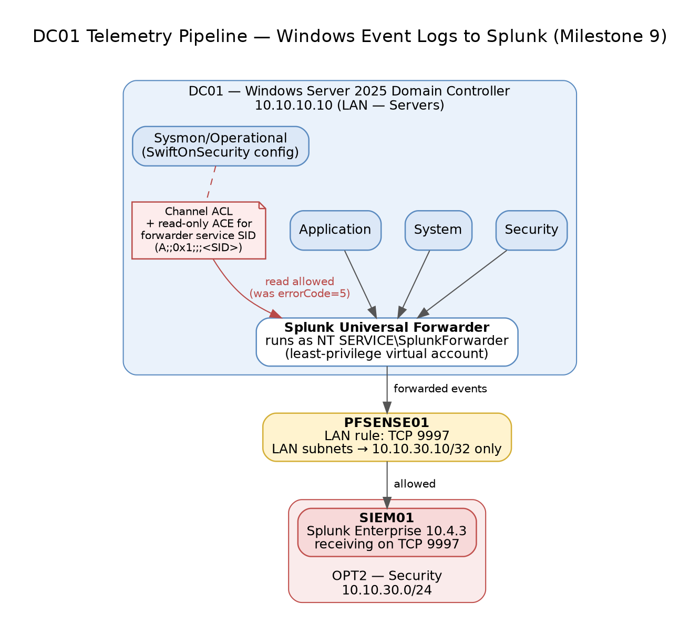
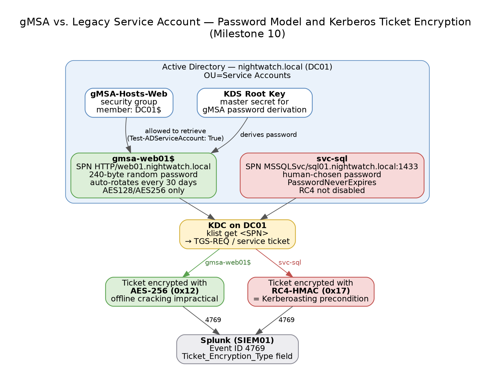

# Project Nightwatch — Enterprise AD & SOC Detection Lab


A segmented, 5-VM enterprise Active Directory lab with a Splunk SIEM, built from scratch to practice the full detection-engineering loop: **build the infrastructure → generate the telemetry → simulate the attack → detect it → harden against it.**

**Author:** Joonwoo Choi — CIT @ Purdue (Class of 2028) · targeting a Summer 2027 SOC / IAM internship

---

## TL;DR (what a reviewer should take away)

- Stood up a realistic **3-zone segmented network** (servers / workstations / security) behind a pfSense firewall, with a Windows Server 2025 domain controller and an Ubuntu + Splunk SIEM.
- Built a **least-privilege telemetry pipeline** from the DC into Splunk and debugged a real Sysmon access-denied failure with a single-permission fix instead of over-privileging the agent.
- Hardened service identity with a **gMSA** (AES-only, auto-rotating password) and **proved the difference in the logs** against a legacy RC4 account.
- Wrote and validated a **Kerberoasting detection** (Splunk alert + Sigma rule), documented as a **SOC-style incident write-up**.

👉 Start here: [**Incident write-up: Kerberoasting**](incidents/2026-09-26-kerberoasting-rc4.md) · [**Detections**](detections/) · [**Tools**](tools/ip-checker/)

## Lab setup



| VM | Role | Segment | IP |
|---|---|---|---|
| PFSENSE01 | pfSense CE 2.9.0 — router / firewall | WAN / LAN / OPT1 / OPT2 | `.1` each segment |
| DC01 | Windows Server 2025 Domain Controller (`nightwatch.local`) | LAN — Servers | `10.10.10.10` |
| WS01 / WS02 | Windows 11 Enterprise, domain-joined | OPT1 — Workstations | `10.10.20.20` / `.31` |
| SIEM01 | Ubuntu 22.04 + Splunk Enterprise 10.4.3 | OPT2 — Security | `10.10.30.10` |

Workstations reach the DC only on required AD ports; log forwarding crosses into the Security zone on a single host/port (TCP 9997).

## What I found & built

### 1. Least-privilege telemetry pipeline


The DC forwards Security, System, Application, and Sysmon logs to Splunk under a **virtual service account** (not LocalSystem). Sysmon ingestion failed with `errorCode=5` (access denied); root cause was the Sysmon channel's access list. **Fix:** one read-only ACE for the forwarder's service SID — not full system rights.

### 2. gMSA vs. legacy service account


A gMSA (240-byte auto-rotating password, host-scoped retrieval, AES-only) was compared in Splunk against a legacy service account. **Result:** the legacy account received an **RC4** service ticket (`0x17`) — the Kerberoasting precondition — while the gMSA received **AES-256** (`0x12`).

### 3. Kerberoasting detection (detection-as-code)
A scheduled Splunk alert flags RC4 service tickets for user accounts, mapped to **MITRE ATT&CK [T1558.003](https://attack.mitre.org/techniques/T1558/003/)**, validated end-to-end, and ported to a portable **[Sigma rule](detections/sigma/)**. Full investigation in [incidents/](incidents/2026-09-26-kerberoasting-rc4.md).

## Repository layout

```
incidents/        SOC-style investigation write-ups (timeline, evidence, verdict, next steps)
detections/       Splunk detections + Sigma rules (detection-as-code)
tools/            Small security automation tools (Python)
diagrams/         Architecture and data-flow diagrams
```

## Milestones

| # | Milestone | Focus |
|---|---|---|
| 1–8 | Lab build: VirtualBox, DC01, OUs + 30 users, Sysmon, WS01/WS02, pfSense segmentation, SIEM01, DNS troubleshooting | Infrastructure |
| 9 | Universal Forwarder + Sysmon ingestion from DC01 | Telemetry |
| 10 | gMSA + Kerberos ticket-encryption telemetry | IAM |
| 11 | Kerberoasting detection (Splunk alert + Sigma) | Detection engineering |
| 12 | Joiner/Mover/Leaver lifecycle automation *(in progress)* | IAM automation |

## Roadmap
JML automation · least-privilege file shares · access-review reporting · attack-chain simulation · AI-agent prompt-injection detection · Entra ID / Okta tenant.

## Note
Isolated home lab. No credentials, passwords, or secrets are committed to this repository.
